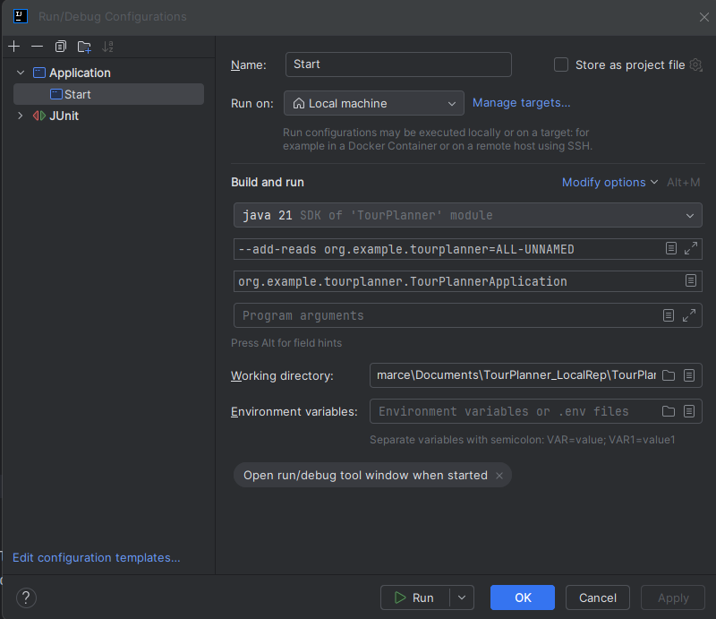
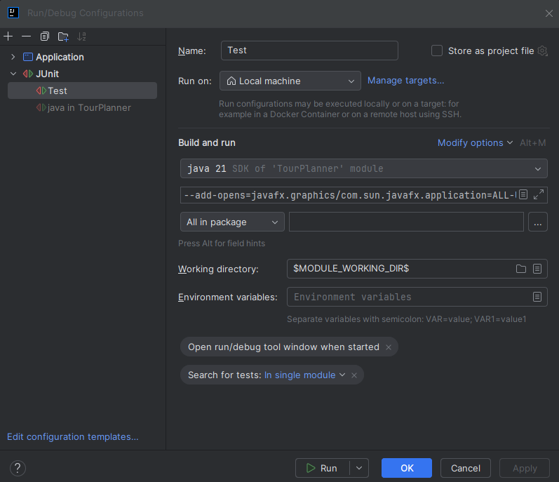

# TourPlanner_SchrenkG-ssl
Backand and Frontend Java Project

    !IMPORTANT!
How to Start the APPLICATION in IntelliJ IDEA
1. Open Run Configurations
    - In the top-right corner of IntelliJ, click on the dropdown next to the green run button and select "Edit Configurations...".

2. Create a New Application Configuration
    - Click on the + icon and select "Application".

3. Set a Name
    - Name the configuration (e.g., Start).

4. Select the Main Class
    - In the Main class field, enter:
    - org.example.tourplanner.TourPlannerApplication"

5. Select the Module
    - Choose the correct module (e.g., tourplanner) under Use classpath of module.

6. Set Java Version
    - Make sure Java 21 is selected as the JDK.

7. Add VM Option
    - Click on Modify options → Add VM options, then add:
    - --add-reads org.example.tourplanner=ALL-UNNAMED
   
8. Save and Run
    - Click Apply and OK, then run the new configuration using the green run button.

How to run the UNIT TESTS in IntelliJ IDEA
   - run the same configuration as above, but select the "Test" option instead of "Application"
   - Click on Modify options → Add VM options, then add: --add-opens=javafx.graphics/com.sun.javafx.application=ALL-UNNAMED
